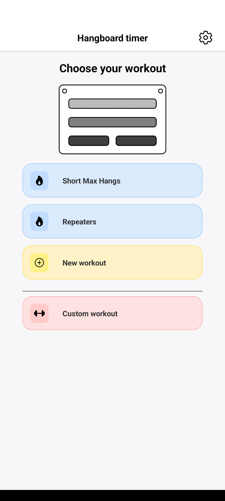
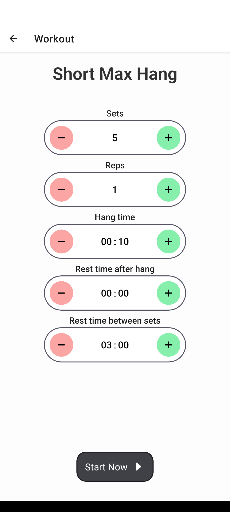
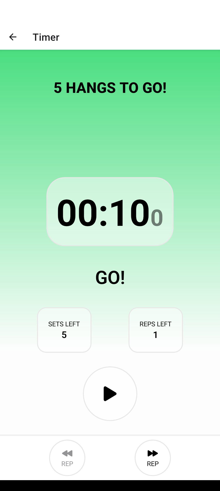
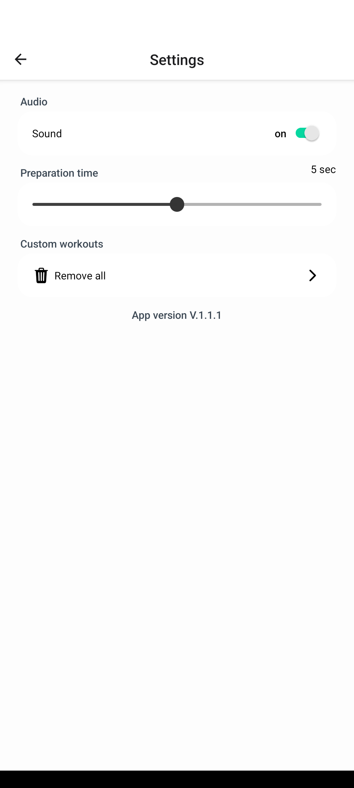

<p align="center">
    
    <h1 align="center">Hangboard Timer</h1>
</p>


A very simple and highly customizable hangboard timing app for Android

> [!NOTE]  
> Hopefully someday on Google Play Store

---

<p align="center">
  
  
  
  
</p>

---


## :hammer: Build it yourself

Run the following commands:

```bash
# Clone this repo
git clone https://github.com/Jookare/HangboardTimer && cd HangboardTimer
# Install dependencies
yarn install

# Run the app with Expo
yarn start
```

The [Expo](https://expo.io) packager will show, and you can either:

-   install the Expo app, scan the displayed QR code, and run the app on your mobile phone directly.
-   open the Android simulator.
