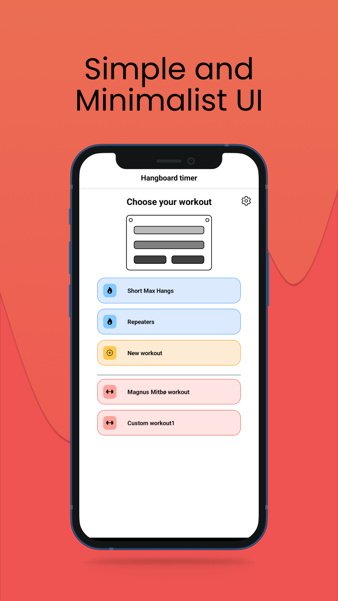
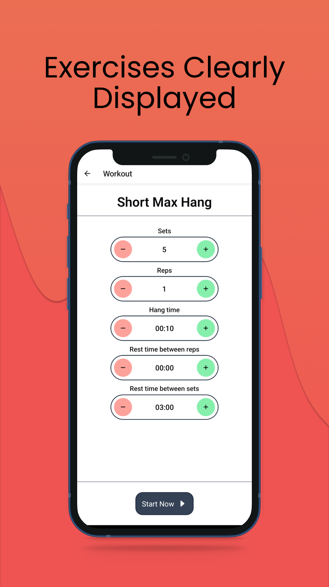
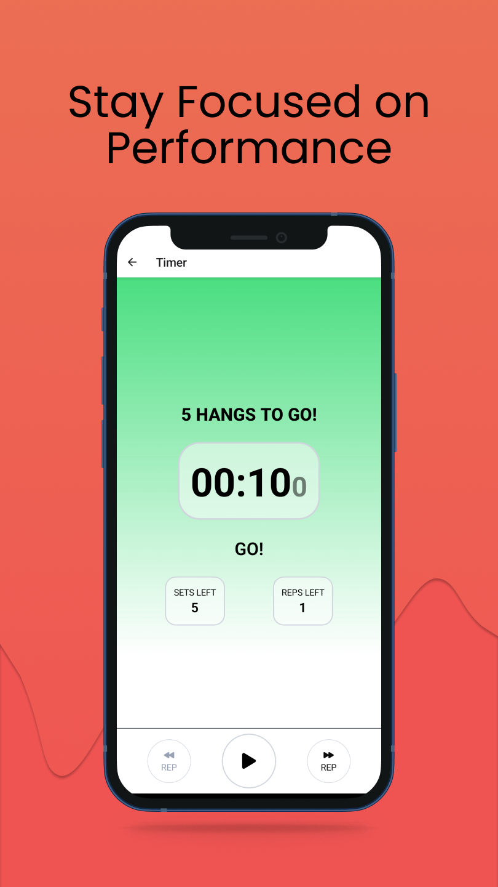
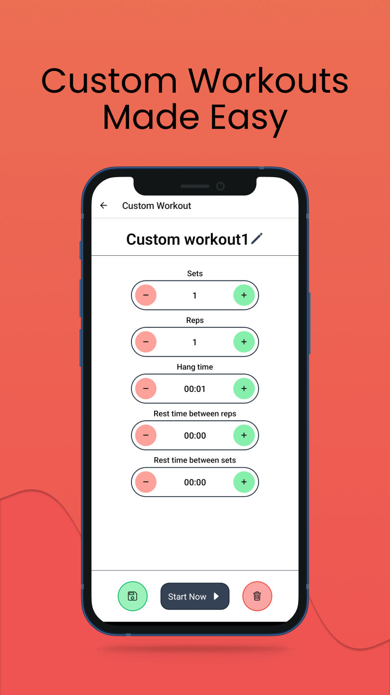
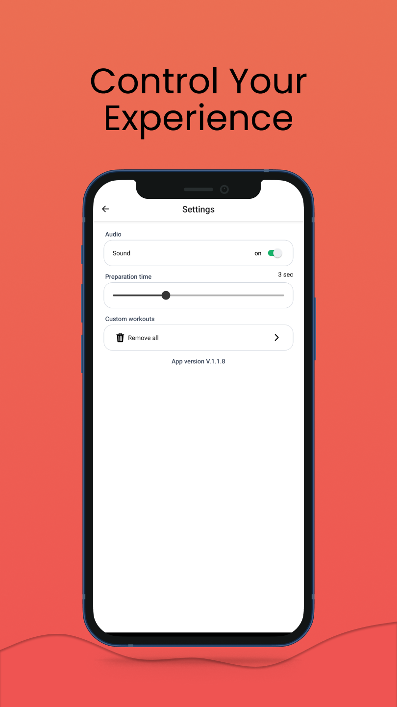

<p align="center">
    
    <h1 align="center">Hangboard Timer</h1>
</p>

<p align="center">
  <a href="https://play.google.com/store/apps/details?id=com.jookare.HangboardTimer">
    
  </a>
</p>

A Simple and customizable hangboard timer🧗


### Features:

- ⚒️ Custom Workouts: Create and save personalized workouts for quick access.
- 📱 User-Friendly Design: A clean, minimalist interface to keep you focused.
- 🚫 No Ads or Registration: Train without interruptions or account setup.
- 💾 Offline Storage: Your workouts are saved securely on your device.

> [!NOTE]  
> Hopefully someday on Google Play Store
---


<p align="center">
  
  
  
  
  
</p>

---


## :hammer: Build it yourself

Run the following commands:

```bash
# Clone this repo
git clone https://github.com/Jookare/HangboardTimer && cd HangboardTimer
# Install dependencies
npm install

# Run the app with Expo
npm start
```

The [Expo](https://expo.io) packager will show, and you can either:

-   install the Expo app, scan the displayed QR code, and run the app on your mobile phone directly.
-   open the Android simulator.

