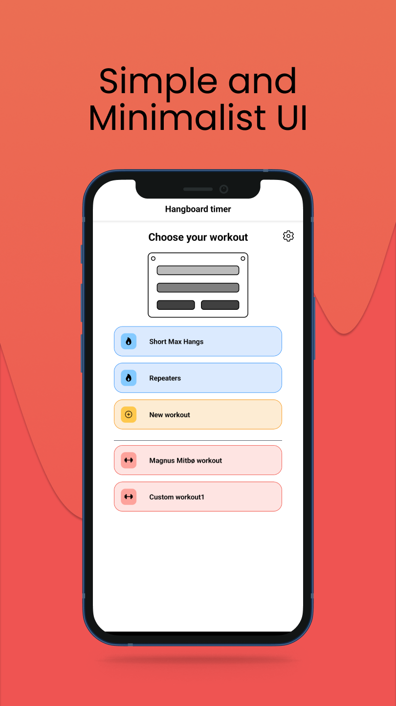
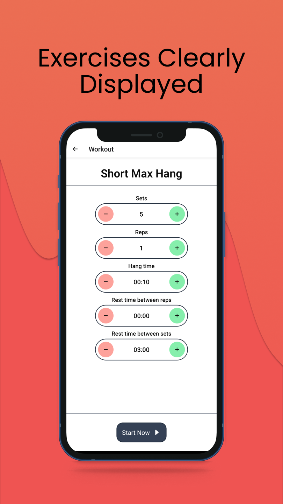
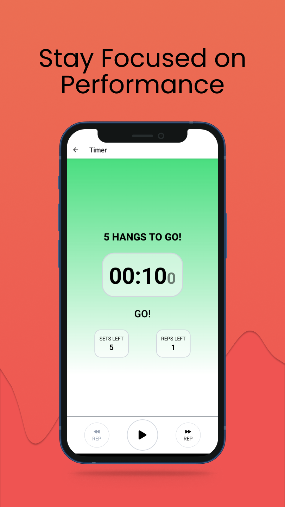
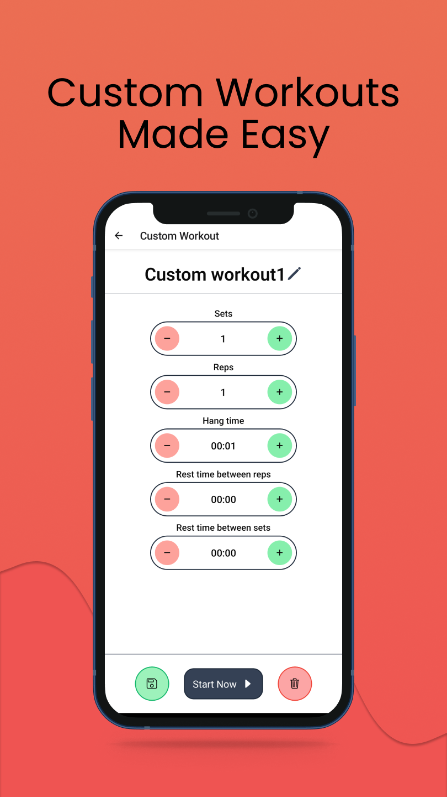
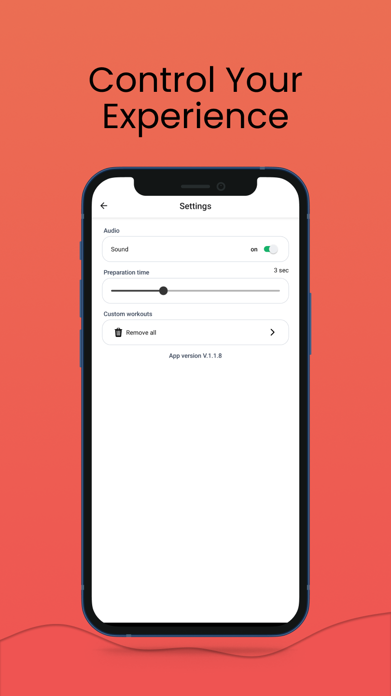

<p align="center">
    
    <h1 align="center">Hangboard Timer</h1>
</p>

<p align="center">
  <a href="https://play.google.com/store/apps/details?id=com.jookare.HangboardTimer">
    
  </a>
</p>

A simple and customizable hangboard timer 🧗

### Features

- ⚒️ **Custom workouts** – create, edit and save your own sets/reps/rest schemes
- ⏱️ **Reliable timer** – prep countdown, per-rep and per-set rest, sound cues, background pause/resume, skip forward/back a rep
- 📒 **Training log** – every finished session is saved on device
- 🚫 **No ads, no account, offline** – all data stays on your phone

---

<p align="center">
  
  
  
  
  
</p>

---

## :hammer: Build it yourself

```bash
# Clone this repo
git clone https://github.com/Jookare/HangboardTimer && cd HangboardTimer
# Install dependencies
npm install
# Start the Expo dev server
npm start
```

Then install [Expo Go](https://expo.dev/go) and scan the QR code, or open an Android/iOS
simulator from the Expo CLI.

## Project structure

Built with [Expo](https://expo.dev) (SDK 54) and [Expo Router](https://docs.expo.dev/router/introduction/)
file-based routing.

```
app/                       routes (file-based)
  (tabs)/                  Home · Training log · Settings
  workout/[id]/            configure a workout + run the timer
  workout/new.js           create a custom workout
components/
  ui/                      design-system primitives (cards, counters, time picker, ring…)
  timer/                   timer-screen pieces (gradient, phase text, controls)
constants/common.js        palette / shadows / colour schemes
constants/workouts.js      built-in workout presets
hooks/
  useWorkoutTimer.js       the timer state machine
  useSounds.js             beep playback (expo-audio)
  useWorkouts / useHistory / useSettings   persisted stores
  useEditableValue / useLongPress          small UI hooks
lib/
  storage.js               namespaced AsyncStorage JSON helpers
  migrate.js               one-time migration from the pre-2.0 storage layout
  time.js                  time formatting / parsing helpers
```

Custom workouts, training-log entries and settings are stored in `AsyncStorage` under the
`hbt.*` namespace. On first launch after upgrading, `lib/migrate.js` converts any workouts and
settings saved by an older version into the new schema.
